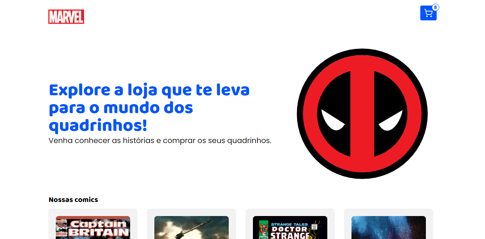

<h1>Teste Desenvolvedor Frontend Cinnecta</h1>

<p align="center">
  
    
  
  
  
  
</p>

> Status do Projeto: :heavy_check_mark:

### Tópicos

:small_blue_diamond: [Descrição do projeto](#descrição-do-projeto)

:small_blue_diamond: [Funcionalidades](#funcionalidades)

:small_blue_diamond: [Como rodar a aplicação](#como-rodar-a-aplicação-arrow_forward)

## Descrição do projeto


<p align="justify">
  E-commerce de quadrinhos usando Marvel API.
</p>

## Funcionalidades
<p>
  Nesse projeto é possível ver as descrições e realizar a compra dos quadrinhos usando o endereço do usuario.
</p>


## Como rodar a aplicação :arrow_forward:

No terminal, clone o projeto:

```
git clone https://github.com/YanGabrielDev/Comics-commerce.git
```

### APP

Pelo terminal navegue para a pasta Comics-commerce e execute o comando:

```
yarn install
ou
npm install
```

Isso irá instalar as dependências da aplicação para execução no ambiente de desenvolvimento

Depois, basta executar o comando:

```
npm run dev
```
### API

Para a api funcionar é necessario entrar no site [Marvel Api](https://developer.marvel.com/) e cadastrar um usuario para gerar as chaves de autorização e na raiz do projeto substituir no nome do arquivo 'exemple.env' por '.env' e substuir as keys pelas que foram geradas para vc

## Linguagens, dependencias e libs utilizadas :books:

- [React toastify](https://fkhadra.github.io/react-toastify/introduction) - para avisar para o usuario que alguma ação foi executada.
- [React Router Dom](https://reactrouter.com/en/main) - responsável por gerir a navegação (Abas)
- [Axios](https://axios-http.com/docs/intro) - realiza requisições HTTP
- [lucide Icons](https://lucide.dev/guide/) - lib para ícones
- [Api cep](https://apicep.com/api-de-consulta/) - Api que realiza a busca do endereço do usuario usando o cep.


## Desenvolvedores/Contribuintes :octocat:

[<br><sub>Yan Gabriel</sub>](https://github.com/YanGabrielDev)

## Licença

The [MIT License]() (MIT)
